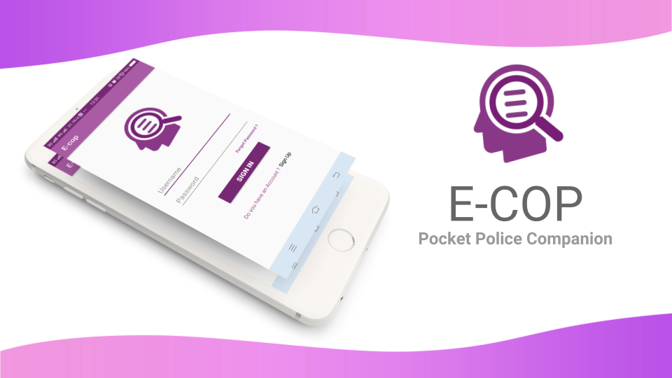
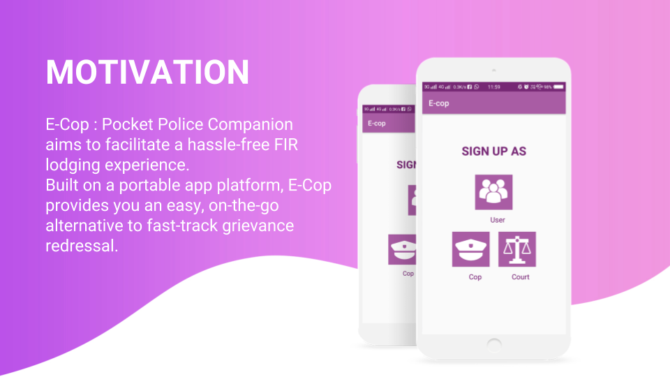
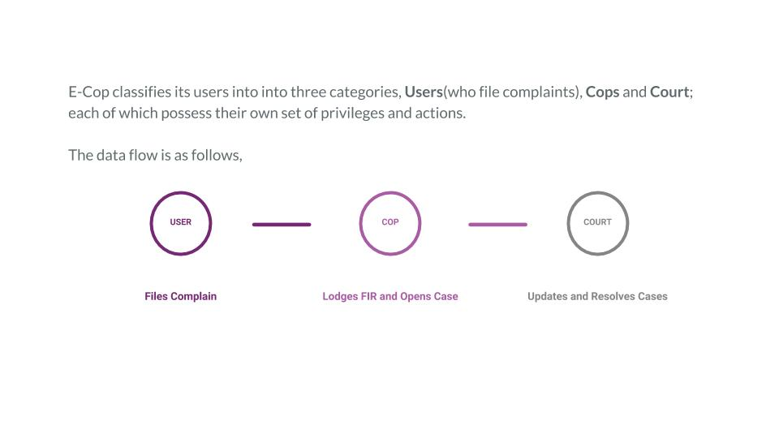

## E-COP-Pocket-Police-Companion

### Database Management System
Created by [IIT2016111](https://github.com/Aotoge),[IIT2016512](https://github.com/bellatrix007) and ITM2016008 for IDBMS432C
Taught by Prof. O. P. Vyas and Dr. Ranjana Vyas,
Department of Information Technology, IIIT Allahabad

### Description

### Overview

### Tech Stacks Used

 *Software* :Android Studio 3.0.0-beta/3.0.1

 *Database* : SQLite Database.
